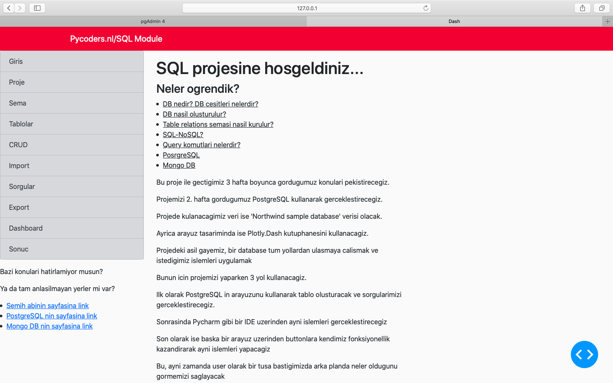
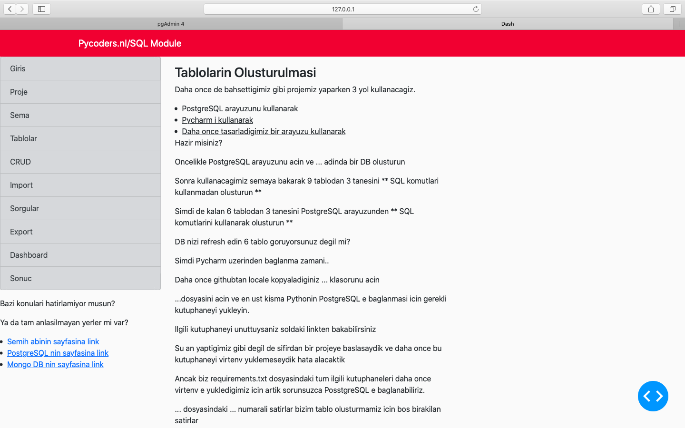
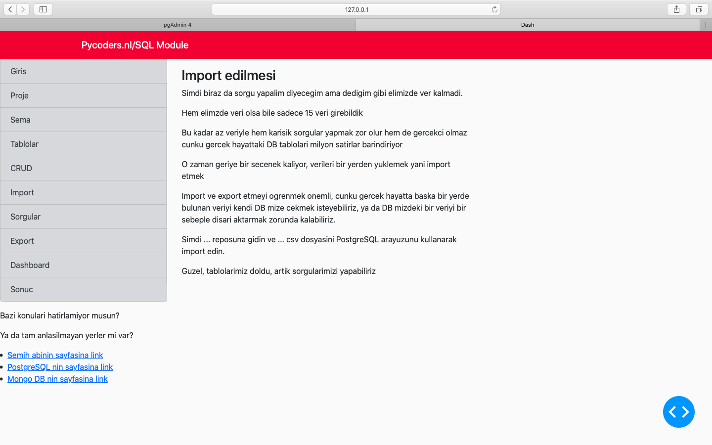
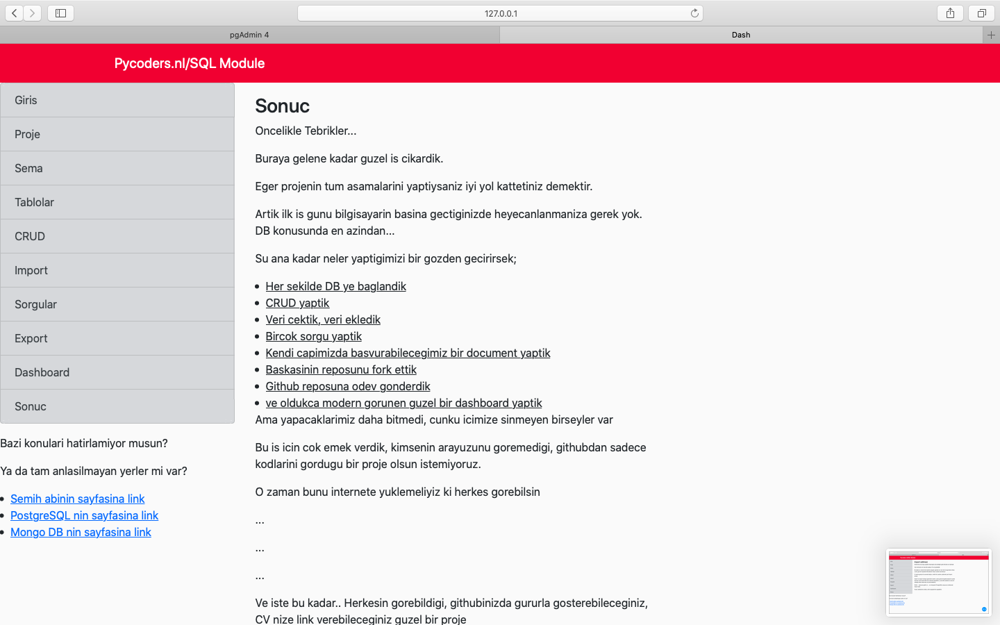

# This file contains the codes of an assignment platform of Pycoders.nl. Located in Amsterdam, Pycoders is a group of volunteers came together with the aim of teaching Python programming language to talented newcomers and helping them find jobs within the IT sector in the Netherlands.

### Giris page

### Tablolar page

### Import page

### Sonuc page

